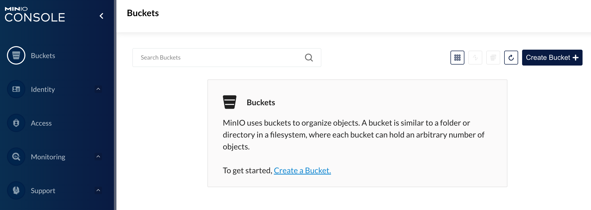
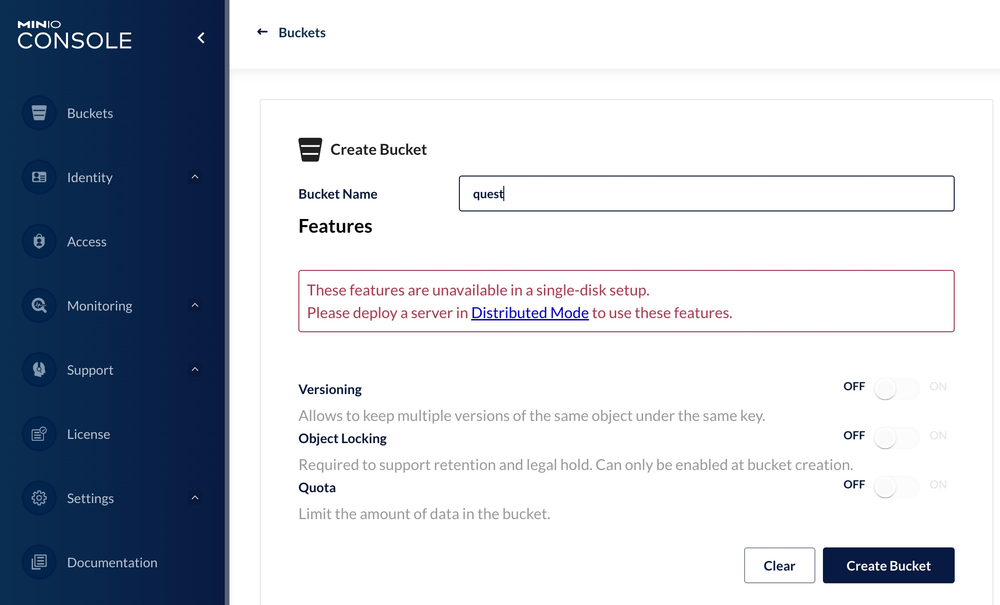
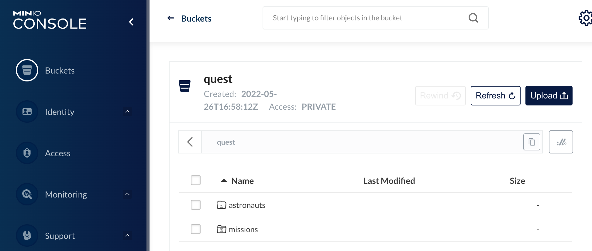
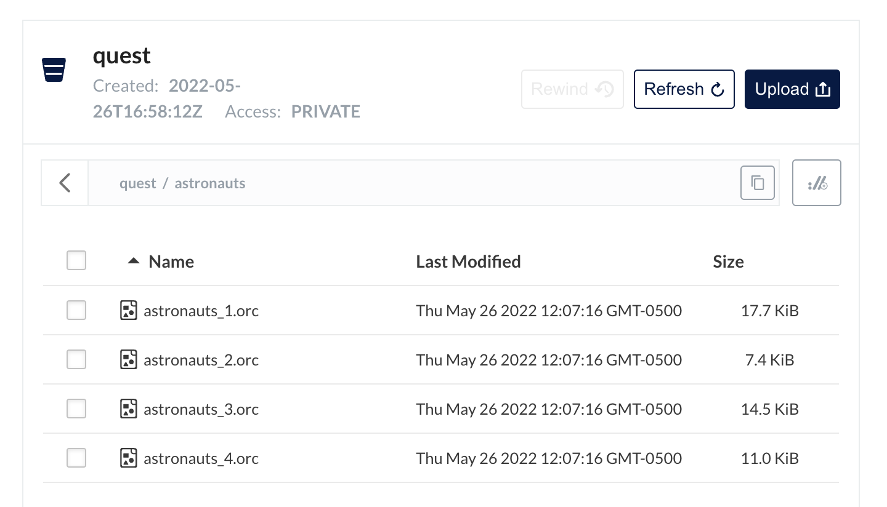

# Space Quest League Challenge Instructions

## Introduction 
For the purpose of these SQL Challenges, we will be uploading some ORC files to minIO and using the Trino CLI to query them.  If you are new to Trino or Presto®, I recommend that you check out the following
blog to get a sense for the Hive connector architecture [A gentle
 introduction to the Hive connector](https://trino.io/blog/2020/10/20/intro-to-hive-connector.html) and look deeper at the [trino-getting-started repo](https://github.com/bitsondatadev/trino-getting-started). 

## Create Your Trino Setup

In order to complete the challenges, you need the data we are wondering about.  I have shared the code below for creating the schema and the two tables within the Trino CLI, as well as some screenshots from uploading the ORC files to minIO. 


### Running Services

First, you want to start the services. Make sure that you are in the 
`trino-getting-started/hive/trino-minio` directory. Now run the following
command:

```
docker-compose up -d
```

You should expect to see a similar output to the one below

```
Network trino-minio_trino-network          Created                
Container minio                            Started       
Container trino-minio-trino-coordinator-1  Started 
Container trino-minio-mariadb-1            Started
Container trino-minio-hive-metastore-1     Started
```
## Create Your Bucket in MinIO

If we look at the Trino Architecture, we're first going to prep the file storage
where the actual data will reside. Creating a bucket gives
us a location to write our data to and we can tell Trino where to find it.


Now, open the [MinIO UI](http://localhost:9000) and log in using:

Access Key: minio

Secret Key: minio123


Create a Bucket by clicking (+) button and create bucket.



Name the bucket `quest` or the same SQL Challenge identifier used in your SCHEMA. This is where we will upload our ORC files. 


## Open Trino CLI

Once this is complete, you can log into the Trino coordinator node. We will
do this by using the [`exec`](https://docs.docker.com/engine/reference/commandline/exec/)
command and run the `trino` CLI executable as the command we run on that
container. Notice the container id is `trino-minio-trino-coordinator-1` so the
command you will run is:

```
docker container exec -it trino-minio-trino-coordinator-1 trino
```

When you start this step, you should see the `trino` cursor once the startup
is complete. It should look like this when it is done:
```
trino>
```
 Run a command to show the catalogs to see the `minio` catalog. This is actually a Hive
connector configured under the name `minio` to delineate the underlying storage
we are using.

```
SHOW CATALOGS;
```

## Creating Schema and Tables
We now want to create our Trino SCHEMA to reference our minIO bucket. Use an identifier `quest` or some other SQL Challenge identifier.

```
CREATE SCHEMA minio.quest
WITH (location = 's3a://quest/');
```
After creating the SCHEMA, we can now move on to creating our tables. 

Run the create table statement to create the **Astronauts** table.
```
CREATE TABLE minio.quest.astronauts (
id integer,
number integer,
nationwide_number integer,
name varchar,
sex varchar,
year_of_birth integer,
nationality varchar,
military_civilian varchar,
selection varchar,
year_of_selection integer,
mission_number integer,
total_number_of_missions integer,
occupation varchar,
year_of_mission integer,
mission_title varchar,
ascend_shuttle varchar,
in_orbit varchar,
descend_shuttle varchar,
hours_mission double,
total_hrs_sum double,
eva_hrs_mission double,
total_eva_hrs double
)
WITH (
 format = 'ORC',
 external_location = 's3a://quest/astronauts/'
);
```

Run the create table statement to create the **Missions** table.
```
CREATE TABLE minio.quest.missions (
id integer,
company_name varchar,
location varchar,
date varchar,
detail varchar,
status_rocket varchar,
cost double,
status_mission varchar
)
WITH (
format = 'ORC',
external_location = 's3a://quest/missions/')
;
```
## Uploading ORC Files to MinIO
Switching back to our MinIO UI, if we click inside of our `quest` bucket, we can see both an `astronauts` and a `missions` location now available. 


### Astronauts
Click into the `astronauts` folder, and upload the ORC files available in the [space-quest-league-trino/data-files/astronaut-orc-files/](https://github.com/monimiller/space-quest-league-trino/tree/main/data-files/astronaut-orc-files) folder. Your final view should have the four astronauts ORC files successfully uploaded. 



### Missions 
Click into the `missions` folder, and upload the ORC files available in the [space-quest-league-trino/data-files/mission-orc-files/](https://github.com/monimiller/space-quest-league-trino/tree/main/data-files/mission-orc-files) folder. Your final view should have the four missions ORC files successfully uploaded. 


## Querying Trino

Congrats! We have loaded the ORC files to MinIO, created our schema, and created our tables. Running a simple `select * from` query on each table can validate our final results. 

```
SELECT * FROM minio.quest.astronauts LIMIT 50;
```

```
SELECT * FROM minio.quest.missions LIMIT 50;
```

Good luck in solving the Space Quest League SQL Techinical Challenges, and reach out to me with any questions.

Happy Querying!!
### Stopping Services

Once you complete your queries, the resources used for this exercise can be released
by running the following command:

```
docker-compose down
```


See trademark and other [legal notices](https://trino.io/legal.html).
